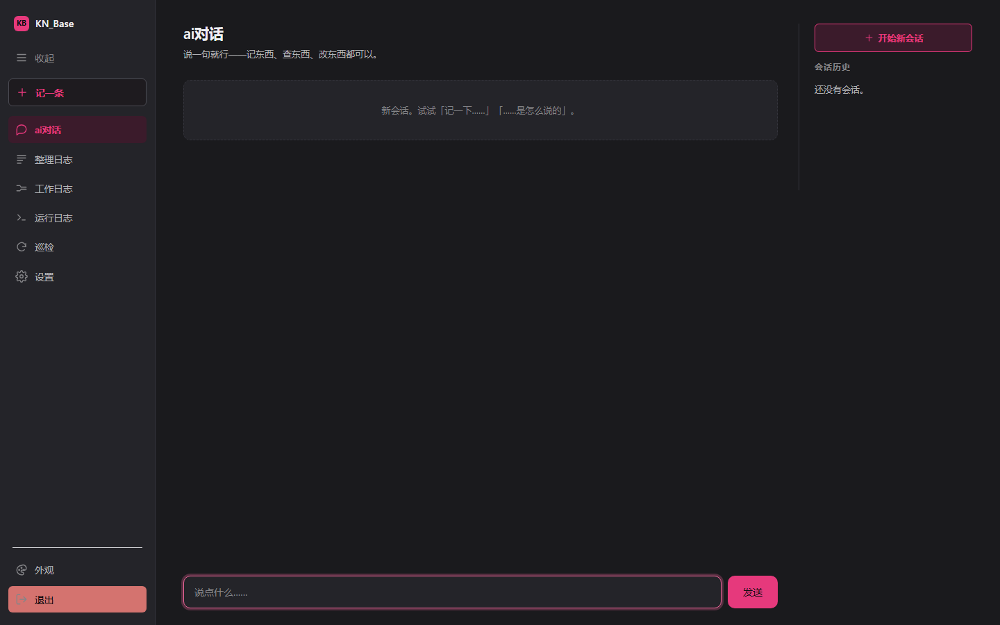
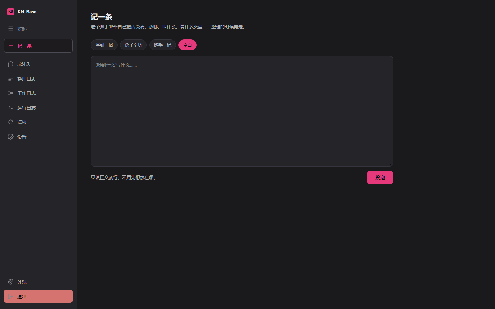
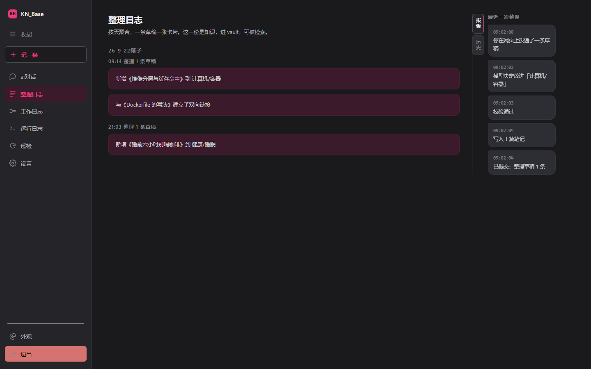
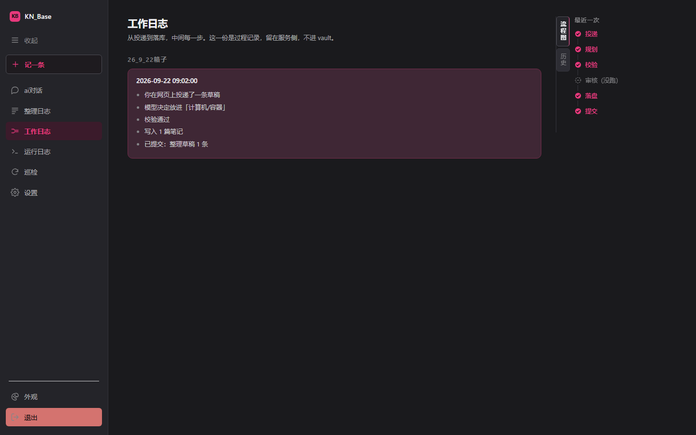

# KN_Base

一个**给 AI 用的个人知识库**。你在任何会话里随口说一句值得记的话，它自己判断放哪、
写成什么、打什么标签；你要查的时候，让会话里的 AI 代你查，或打开网页直接问。

它不是笔记软件，是一层**给 AI 用的存储与整理**：知识本体是纯 markdown，放在一个
独立的 Obsidian vault 里（`git` 管着），代码在这个仓库。两者物理分离、各自独立
版本管理——Obsidian 只是它的一个视图，卸载了文件还在、git 历史还在。

## Highlights

- **说一句就行，不用想结构。** 投递只交正文——类型、标签、放哪、叫什么名字一概
  不填，那是整理阶段的事。一次投递 = 一条草稿。

- **文件夹定位置，标签定主题。** 一条知识天然属于多个上下文，可文件夹只能有一个。
  所以这里不靠文件夹检索：**一篇挂多个标签，文件夹放错了也不影响找得到**——
  于是「AI 偶尔分错类」不再是致命问题，也就不需要逼人逐条审核。

- **改已有笔记不覆盖。** 旧内容打失效标记保留、默认不再出现在检索结果里，
  这样能看出结论是怎么演变的。

- **整理过程全程可查。** 从投递到落库，每一步干了什么都有记录，页面上一条条
  列着——**「跳过」和「没走到」画得不一样**（前者是没触发，后者才是卡住）。

- **库是有状态的，能搬、能扔。** 未初始化时界面上一张引导卡、写入口置灰、端点回
  409；建好之后能整个搬去别处，也能连着痕迹一起移除。不靠一个写死的默认路径糊过去。

- **纯 markdown，本地优先。** 没有数据库、没有隐藏格式，记事本能打开；知识存在你
  自己的机器上。



## 安装

```bash
conda create -n kn_base python=3.11 -y && conda activate kn_base
pip install -r requirements.txt
cp .env.example .env                 # Windows cmd: copy .env.example .env
```

`.env` 里**只需要填模型三件套**（另外两项 `.env.example` 已经给了能用的值）：

```
KB_LLM_API_KEY=sk-...
KB_LLM_BASE_URL=https://api.deepseek.com
KB_LLM_MODEL=deepseek-flash
```

空着不会静默降级——**除了 `kb stop`，每条 `kb` 命令都会当场停下**并说清缺哪一项。

## 用法

库里还没东西时，双击 **`web.bat`**，首屏那张引导卡按三段填完就是一条龙：建目录、
写 `.gitignore`、`git init`、首次提交。之后：

```bash
kb push --content "并发写入会锁表，最后用队列串行化解决" --source 会话
kb inbox                                  # 看攒了几条
kb organize                               # 整理落库
kb search "缩放"
kb drop 20260918-9e4f                     # 投错了就撤（可给多个 id）
```

**谁决定什么时候整理：** 会话 AI 判断。规则写在 [`docs/接入指南/`](docs/接入指南/)
——那是会话层 AI 能读到的地方（一份 skill），不是给人看的说明文档。

## 界面

| | |
|---|---|
| <br>**ai对话** | <br>**记一条** |
| <br>**整理日志** | <br>**工作日志**——流程图分三态 |

> 截图跑的是一份**编出来的演示库**。配色是默认那套 `dark-pink`（炭黑 × 玫红），
> 另外五套在左栏底部「外观」里切。

## FAQ

**跟「用 Obsidian 自己记」有什么不一样？**
记的时候不用想结构，找的时候不用记得放在哪。

**整理会改动我已有的笔记吗？**
会 fold（把新洞见并进已有的那一篇），但**旧内容不会消失**——被打上失效标记保留，
默认不再出现在检索结果里。

**能不用 Obsidian 吗？**
能。它只是一堆 markdown 文件；Obsidian 是其中一个好用的视图。

**数据存在哪？**
一个独立的 git 仓库，路径由你定，跟代码仓库物理分离。本文这套跑在 `E:\KB_Library`。

**为什么文件夹放错了也没事？**
因为检索靠标签不靠文件夹——见上面 Highlights 第二条。

## 文档

| 想了解 | 去哪 |
|---|---|
| 它做成什么样、边界在哪 | [`docs/01_架构.md`](docs/01_架构.md) |
| 要什么、明确不做什么 | [`docs/02_需求.md`](docs/02_需求.md) |
| 每个设计为什么这么做 | [`docs/03_问题记录.md`](docs/03_问题记录.md) |
| 踩过的坑 | [`docs/04_踩坑与经验.md`](docs/04_踩坑与经验.md) |
| 全部配置项 | [`.env.example`](.env.example) |
